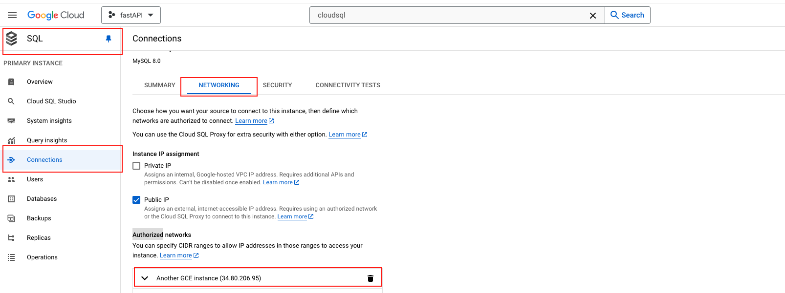

## Google Compute Engine
* 此教學為如何 deploy 自己的專案到 GCE 上面
* 參考文章：https://blog.typeart.cc/deploy-database-container-to-gce/


### 第一步驟: 準備檔案

之後把自己的 `fastAPI` 檔案，`push 到 github`: 裡面有完整的檔案可以使用 

```shell
$ git clone '尚未準備'
```


### 第二步驟: 創建 Google 雲端平台專案

- 2.1: 這個很簡單，就是指示單純到 GCP 專案那邊，創建一個新的 `project`，名字可以先隨便取 - `fastAPI`
- 2.2: 進到此網址裡面: https://console.cloud.google.com/compute/instances，點擊 `create instance`: 取名稱為 - `linux-web-server`(可以隨便取)
- 2.3: 選擇區域(Region)，選你想要的，基本上就選 asia 就好了
- 2.4: 選擇時區(Zone)，選你想要的，基本上就選 asia 就好了
- 2.5: 選擇 `防火牆 Firewall`: 選擇 `Allow HTTP traffic.`
- 2.6: 點選 `create`

這樣你的最基礎的 `instance` 就被新增出來了，等等我們要來研究怎麼把在畫面上印出 `hello world!`


### 第三步驟: 安裝 Apache server、印出 hello world

再來我們進到 `instance` 的內部，我們先點選剛剛創造的 `instance`，並且進入後，看上左上方，應該可以找到 `SSH` 連接的按鈕，點下去。   

#### 3-1 Update the package lists on your instance

```shell
lin034506618@linux-web-server:~$ sudo apt-get update
```


#### 3-2 install the Apache2 HTTP Server:

```shell
lin034506618@linux-web-server:~$ sudo apt-get install apache2 php7.0
```

#### 3-3 Overwrite the Apache web server default web page with the following command:
   
以下指令的意思是，在 `instance` 中，創建或覆蓋一個 `index.html` 的檔案，並在裡面寫入內容   
   
* echo 指令: 新增或覆蓋指令
* |: 此符號用於將前一個命令的輸出，作為下一個命令的輸入，也就是把 echo 的結果，傳給 sudo 去做事
* tee 指令: 讀取標準輸入的數據，並將其寫入指定的文件中
* /var/www/html/index.html: 是要寫入的文件路徑，在 `Linux` 中，是 `WEB SERVER` 默認的檔案根目錄  

```shell
lin034506618@linux-web-server:~$ echo '<!doctype html><html><body><h1>Hello World!</h1></body></html>' | sudo tee /var/www/html/index.html
```

:::tip index.html 位置
如果想要找到剛剛設定的 hello world 檔案位置 (index.html)，可以輸入以下指令找到
```shell
lin034506618@linux-web-server:~$ sudo ls /var/www/html
```
:::


這樣輸入完成後，你可以找一下你這個 `instance` 的 `External IP address`，以我為例，我的 ip 是 `34.80.206.95`，因此我在瀏覽器上輸入此網址，就可以看到 `Hello World!` 這幾個字。  


### 第四步驟: 上傳應用程式到 cloud storage

剛剛已經確認我們新開的 `instance` 可以印出 `hello world`，現在來把一開始拉下來的應用程式傳上去，首先我們把資料傳到 `cloud storage` 先：

```shell
# 這邊在本地端的檔案內，執行此指令

$ gsutil cp -r /Users/yee0526/Desktop/python/fastAPI_Docker gs://fastapi-gce/  
```

Ps. 在剛剛拉下來的檔案，輸入以下指令 `gsutil cp -r 本地資料夾位置 gs://storage-name/`，這個指令可以把現在這個檔案傳上 `cloud storage`


### 第五步驟: 把 cloud storage 的資料傳到 instance

等本地端檔案傳好後，接著可以再次進入 `instance` 的 `SSH` 連接裡面，我們要來把剛剛傳的資料傳進來:

```shell
# instance SSH connect

lin034506618@linux-web-server:~$ gsutil cp -r gs://fastapi-gce/fastAPI_Docker /home/lin034506618/
```

Ps. 把 cloudStorage 資料送進 GCE: `gsutil cp -r gs://your-bucket-name/fastAPI_Docker /home/lin034506618/`，`fastAPI_Docker` 是資料夾名稱、`lin034506618` 是你的 gmail 信箱


### 第五步驟: 安裝 docker

上傳好後，我們先來確認一下是否安裝成功，執行以下指令：

```shell
lin034506618@linux-web-server:~$ ls

------
fastAPI_Docker
```

如果有看到這個資料夾，就代表剛剛上傳檔案是有成功的！再來我們先來安裝 `docker`


#### step1

```shell
lin034506618@linux-web-server:~$ sudo curl -L "https://github.com/docker/compose/releases/download/1.29.2/docker-compose-$(uname -s)-$(uname -m)" -o /usr/local/bin/docker-compose
```


#### step2

```shell
lin034506618@linux-web-server:~$ sudo chmod +x /usr/local/bin/docker-compose
```


兩段指令都執行後，再次執行以下指令，這個指令可以確認現在 docker 的版本:

```shell
lin034506618@linux-web-server:~$ docker-compose --version

------
docker-compose version 1.29.0, build 0aa59064
```

### 第六步驟: 執行 docker

```shell
lin034506618@linux-web-server:~$ sudo docker-compose up --build

------
# ...忽略
# 執行後應該會印出一段無法連接 cloudSQL 的錯誤，原因是因為沒有到 cloudSQL 那邊允許連接的 ip
fastapi_1  | sqlalchemy.exc.OperationalError: (pymysql.err.OperationalError) (2003, "Can't connect to MySQL server on '35.201.232.244' (timed out)")
```


### 第七步驟: cloudSQL Authorized networks

由於 `cloudSQL` 會需要開通特定的 `ip` 才能讓你連接，因此我們到依此步驟新增權限 -> `cloudSQL` -> `connections` -> `networking` -> `Authorized networks` -> `新增 GCE instance ip`。   
   
不確定可以看下圖怎麼新增：   




### 第八步驟: 再次執行 docker

* 先刪除掉之前建立的 docker 資料

```shell
lin034506618@linux-web-server:~$ sudo docker-compose down

------
Removing fastapi_docker_fastapi_1 ... done
Removing fastapi_docker_db_1      ... done
Removing network fastapi_docker_default
```

* 再次啟動 docker

```shell
lin034506618@linux-web-server:~$ sudo docker-compose up --build

------
fastapi_1  | 2024-08-01 04:06:31,061 INFO sqlalchemy.engine.Engine [generated in 0.00022s] {'param_1': 1}
fastapi_1  | 2024-08-01 04:06:31,065 INFO sqlalchemy.engine.Engine COMMIT
fastapi_1  | INFO:     Application startup complete.
fastapi_1  | INFO:     Uvicorn running on http://0.0.0.0:8000 (Press CTRL+C to quit)
```

這時候可以看到最下面這一行，`Uvicorn running on http://0.0.0.0:8000`，由此可知我們的連線成功了，接下來我們就來進入該頁面


### 第七步驟: 瀏覽器輸入 instance 的 external IP

先複製這一段 `http://0.0.0.0:8000` 連結，並且把 `instance` 的 `external IP` 替換掉 `0.0.0.0`，最後會像這樣： `http://34.80.206.95:8000`，但是這時候你會發現，為啥麼網頁無法正常顯示！這時候我們來新增一個東西!


### 第八步驟: 新增 8000 防火牆

剛剛會無法進入 `:8000` 的原因，是因為在防火牆那邊，沒有設定這個 `instance` 要允許 `:8000` 可以通過，因此照著以下順序開通 -> `搜尋 Network Security` -> `點選左側 Firewall policies` -> `點選上方 CREATE FIREWALL RULE`。
   
接下來填寫這幾個欄位：

1. Name: `allow-fastAPI`
2. Targets 下拉選單: `All instances in the network` -> 這裡可以只選擇你現在使用的 `instance`，不過這邊我直接允許所有的 `instance` 比較快
3. source filter: `IPv4 ranges`
4. source IPv4 ranges: `0.0.0.0/0` (這個是允許來自所有 ip address 的流量)
5. Protocols and ports: `選擇  Specified protocols and ports` -> `填寫 TCP: 8000`
6. 最後按下 `save`

這樣就創建了一個允許連進 `:8000` 的防火牆設定


### 第九步驟: 再次連進 external IP

設定好後，再次在網址輸入 `http://34.80.206.95:8000`，就可以發現，現在的畫面不會有錯誤了～  
現在可以正常地使用網站！


### port 影響

#### port 80
還記得我們一開始輸入的網址嗎，是這個 `http://34.80.206.95/`，這時候你會看到畫面上會印出 `hello world`，原因是因為我們前面有設定 `index.html` 這個頁面的關係，而 html 預設的 `port` 就是 `80`，他真正的連結是 `http://34.80.206.95:80`，不過因為正常在使用連結的時候，大家都不會寫出來。  
     
#### port 8000
而 `fastAPI` 常用的 `port` 是 `8000`，因此我在 `docker-compose` 那邊是這樣寫的：

```yaml
services:
  db:
    image: mysql:latest
    environment:
      MYSQL_ROOT_PASSWORD: rootpassword
      MYSQL_DATABASE: ${LOCAL_DB_NAME}
      MYSQL_USER: ${LOCAL_DB_USER}
      MYSQL_PASSWORD: ${LOCAL_DB_PASSWORD}
    ports:
      - "3306:3306"
    volumes:
      - fastapi-mysql:/var/lib/mysql

  fastapi:
    build: .
    ports:
      - "8000:8000"                     # 這邊
```
換成這樣輸入: `http://34.80.206.95:8000`，這樣你就會看到


