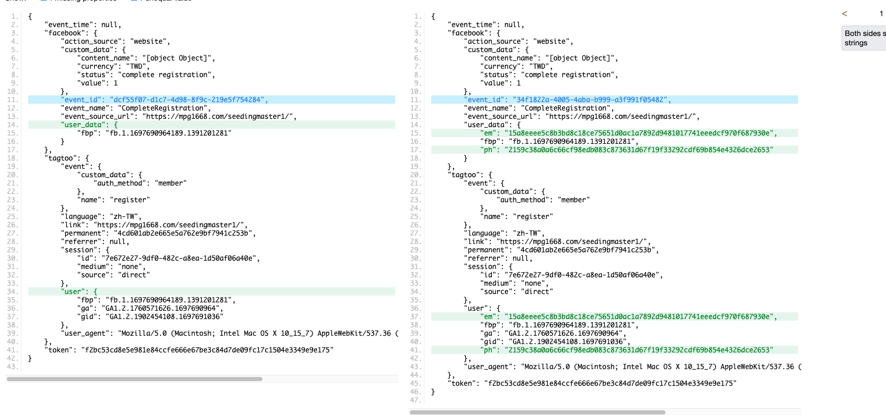

## 3094 - tagtoo Event 的信箱和電話問題


### 詳細說明

客戶反應 facebook 像素後台的 `事件配對品質很低`，希望能改善

### 解決方法

由於客戶的像素有設定s2s，因此事件有從伺服器送過去，而伺服器端也就是 tagtoo event 發送的事件，那邊我們會送幾個特殊資料過去，像是電話和信箱，使用者輸入的信箱和電話會被亂碼化，並且同時發送到 tagtoo_event 和 FB 那邊，如果今天事件有發送 ex. register，但是沒有發送 unitrack 的信箱和電話，就會導致 FB像素後台的 `事件配對品質降低`。


如果今天事件配對值降低，有以下幾件事可以確認
1. 先看客戶網站的 unitrack 是否有成功發送
2. 到 tagtoo event 的 BigQuery 查看事件是否有收到 `信箱和電話`
3. 如果確定沒有收到，就代表 `事件和 unitrack` 的觸發順序有問題
4. 到 `網站的network`，查看 `v1` 的 `payload`，`unitrack` 實際送出的詳細訊息


因此來解釋一下 unitrack 的觸發邏輯，首先可以到這個檔案 `muffet -> src -> tracker -> unitrack -> tracker.js` 找到 unitrack 是怎麼觸發的，裡面有一段是 `new Promise`，因此可以知道 unitrack 的運作方式是 `async`，也就是說當在網站上觸發 `unitrack` 時，他會透過非同步的方式去處理剛剛收到的 `資料(email/phone)`，代表如果在一個頁面，先觸發 `事件`，再觸發 `unitrack` 的話，這個事件並不會馬上收到由 `unitrack` 送出的信箱或電話，除非這個使用者之後再回來這個頁面，再做一次 `相同事件`，這個事件才會帶上 `信箱或電話`。


實際舉個例子：

以 `3004` : `https://mpg1668.com/seedingmaster1/` 為例，這個網站是一頁式網站，如果今天完成報名，會跳到感謝完成頁，假設一開始的事件觸發邏輯是:

1. 如果表單的必填欄位都填寫完成，並且按下送出後，首先送出 `register` 事件
2. 接在 `register` 事件後面送出的是 `unitrack` 事件

這時候我們打開 `DevTool` 中 `Network 的 v1` 資訊，選擇 `payload`，會看到以下資訊：

```md
{
  "event_time": null,
  "token": "f2bc53cd8e5e981e84ccfe666e67be3c84d7de09fc17c1504e3349e9e175",
  "facebook": {
    "user_data": {
      "fbp": "fb.1.1697690964189.1391201281"
    },
    "action_source": "website",
    "event_source_url": "https://mpg1668.com/seedingmaster1/",
    "event_id": "dcf55f07-d1c7-4d98-8f9c-219e5f754284",
    "event_name": "CompleteRegistration",
    "custom_data": {
      "content_name": "[object Object]",
      "status": "complete registration",
      "currency": "TWD",
      "value": 1
    }
  },
  "tagtoo": {
    "permanent": "4cd601ab2e665e5a762e9bf7941c253b",
    "user": {
      "fbp": "fb.1.1697690964189.1391201281",
      "ga": "GA1.2.1760571626.1697690964",
      "gid": "GA1.2.1902454108.1697691036"
    },
    "link": "https://mpg1668.com/seedingmaster1/",
    "referrer": null,
    "user_agent": "Mozilla/5.0 (Macintosh; Intel Mac OS X 10_15_7) AppleWebKit/537.36 (KHTML, like Gecko) Chrome/118.0.0.0 Safari/537.36",
    "session": {
      "id": "7e672e27-9df0-482c-a8ea-1d50af06a40e",
      "source": "direct",
      "medium": "none"
    },
    "language": "zh-TW",
    "event": {
      "name": "register",
      "custom_data": {
        "auth_method": "member"
      }
    }
  }
}
```

這些資料就是當事件發生時，會送的資訊，這時候會發現，tagtoo 事件中並沒有帶上 `phone or email`，不過我們剛剛明明有送 `unitrack`，為什麼會這樣呢？


此時我們再回來觸發 `register` 事件一次，這一次看到的 `payolad` 資訊會像是這樣：

```md
{
  "event_time": null,
  "token": "f2bc53cd8e5e981e84ccfe666e67be3c84d7de09fc17c1504e3349e9e175",
  "facebook": {
    "user_data": {
      "em": "15a8eeee5c8b3bd8c18ce75651d0ac1a7892d9481017741eeedcf970f687930e",
      "ph": "2159c38a0a6c66cf98edb083c873631d67f19f33292cdf69b854e4326dce2653",
      "fbp": "fb.1.1697690964189.1391201281"
    },
    "action_source": "website",
    "event_source_url": "https://mpg1668.com/seedingmaster1/",
    "event_id": "34f1822a-4005-4aba-b999-a3f991f05482",
    "event_name": "CompleteRegistration",
    "custom_data": {
      "content_name": "[object Object]",
      "status": "complete registration",
      "currency": "TWD",
      "value": 1
    }
  },
  "tagtoo": {
    "permanent": "4cd601ab2e665e5a762e9bf7941c253b",
    "user": {
      "em": "15a8eeee5c8b3bd8c18ce75651d0ac1a7892d9481017741eeedcf970f687930e",
      "ph": "2159c38a0a6c66cf98edb083c873631d67f19f33292cdf69b854e4326dce2653",
      "fbp": "fb.1.1697690964189.1391201281",
      "ga": "GA1.2.1760571626.1697690964",
      "gid": "GA1.2.1902454108.1697691036"
    },
    "link": "https://mpg1668.com/seedingmaster1/",
    "referrer": null,
    "user_agent": "Mozilla/5.0 (Macintosh; Intel Mac OS X 10_15_7) AppleWebKit/537.36 (KHTML, like Gecko) Chrome/118.0.0.0 Safari/537.36",
    "session": {
      "id": "7e672e27-9df0-482c-a8ea-1d50af06a40e",
      "source": "direct",
      "medium": "none"
    },
    "language": "zh-TW",
    "event": {
      "name": "register",
      "custom_data": {
        "auth_method": "member"
      }
    }
  }
}
```

可以看到 `tagtoo` 事件中 ， `em 和 ph` 跑出來了，呈現出來的資訊是亂碼型態，這代表的就是 `tagtoo event` 處理完了，只是因為前一次他還在進行 `非同步處理` ，才導致第一次的 `register` 事件沒有帶上 `信箱和電話` 資訊。

看下圖可以更明顯一點：



### PR、需求編號
3095 - 修改 register 觸發位置：  
[muffet] : https://github.com/Tagtoo/muffet/pull/3173  
   
3094 - 修改 register 觸發位置：  
[muffet] : https://github.com/Tagtoo/muffet/pull/3183  
   
[編號] : 3920  
