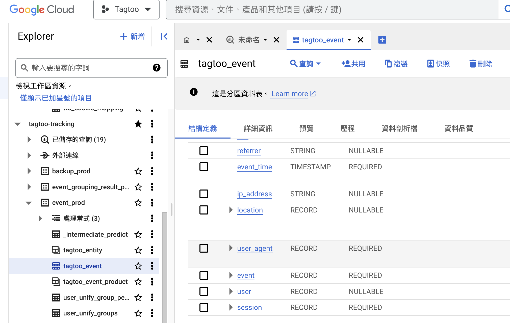

### 詳細描述     
1. 先前填單有說需要把文章分類放在Tagtoo Event 的breadcrumb欄位，但目前該欄位都沒有值
2. Product資料庫裡面都沒有2913的資料（應該要把文章當商品存在Product資料庫）

### 解決方法


#### 問題 1

照著以下步驟來解決：

1. 先打開 Google Cloud
2. 找到 ID 是 tagtoo-tracking 的專案，tagtoo event 的事件就在裡面
3. 點擊 `BigQuery` -> `SQL 工作區` -> `點開 tagtoo-tracking` -> `點開 event_prod` -> `找到 tagtoo_event` -> `點擊 查詢`
4. 輸入以下 SQL 語法，發現 `breadcrumb` 欄位全都是空的，到目前不確定 viewItem 的 event.custom_data.breadcrumb 欄位是否原本就是空值，畢竟我們在 viewItem 一定都有抓 `categoryPath`

```sql
SELECT * FROM `tagtoo-tracking.event_prod.tagtoo_event` WHERE TIMESTAMP_TRUNC(event_time, DAY) = TIMESTAMP("2023-09-03") AND ec_id = 2913 AND event.name = 'view_item_list' LIMIT 1000
```

5. 來確認第四點疑問，換成輸入這個以下SQL，用 2990 發現，viewItem 的 event.custom_data.breadcrumb 欄位也是空的，由此可知 viewItem 事件原本就不會抓到 breadcrumb 欄位
```sql
SELECT * FROM `tagtoo-tracking.event_prod.tagtoo_event` WHERE TIMESTAMP_TRUNC(event_time, DAY) = TIMESTAMP("2023-09-03") AND ec_id = 2990 AND event.name = 'view_item_list' LIMIT 1000
```


6. 我們來輸入以下SQL，了解 `Data team` 是抓什麼，可以讓 event.custom_data.breadcrumb 欄位不為空，照以下輸入後，會發現 `event_name` 欄位是 `view_item_list`
```SQL
SELECT *
FROM `tagtoo-tracking.event_prod.tagtoo_event`
WHERE TIMESTAMP_TRUNC(event_time, DAY) = TIMESTAMP("2023-09-01")
AND ec_id = 2990
AND event.custom_data.breadcrumb IS NOT NULL
LIMIT 1000;
```

7. 由此可知，我們只要補上 viewItemList 的事件，就可以讓 DataTeam 想抓的 breadcrumb 欄位跑出來了
8. 所以只要在抓產品頁面的時候，補上 viewItemList 事件就可以完成這個需求


這邊補上 tagtoo event 要到哪裡看的圖片：


#### 問題 2
問題 2 的解決方法，沒有匯入資料庫有幾個原因  
(1) sku 的格式不對   
(2) 少了幾個規定欄位，可以到這邊，查看匯入資料酷的格式規定 - https://github.com/Tagtoo/tracknew  
   
Ps. 我這次無法匯入資料庫，是因為少設定了價格欄位，價格一定要 >=0 才匯得進去  


### PR、需求編號
[muffet] : https://github.com/Tagtoo/muffet/pull/2939  
[muffet] : https://github.com/Tagtoo/muffet/pull/2940  
[編號] : 3852  