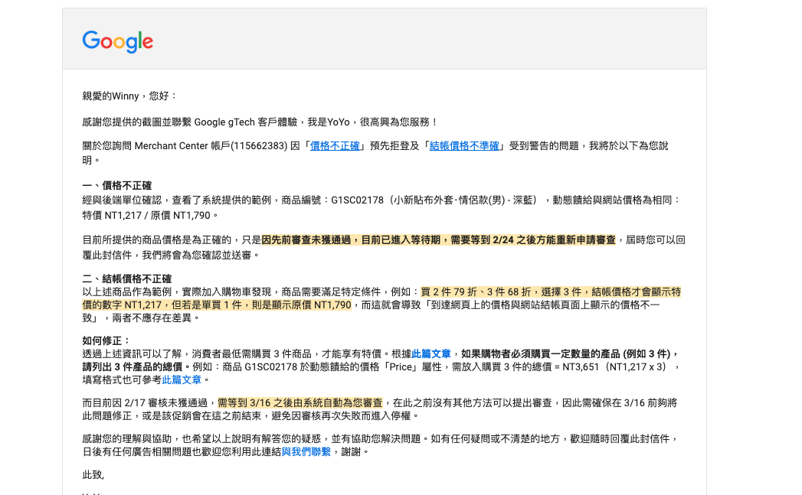
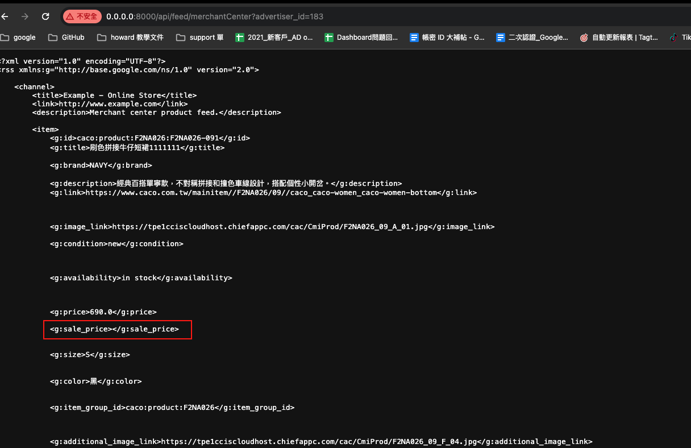

### 詳細描述     

由於 caco 網站的商品訂價比較特別，他們網站特別的地方就是，網站上的特價，是必須購買到一定的數量後，該商品才會享有該價錢。

ex. 商品編號：G1SC02178（小新貼布外套‧情侶款(男) - 深藍），此商品價錢為：特價 NT1,217 / 原價 NT1,790。

因此原先我們的前端爬蟲抓法為：`原價 - store_price: 1790, 特價 - price: 1217`，因此資料庫裡面就是這樣存 `store_price: 1790, price: 1217`，也因此產出的 feed 價錢就為是這樣。

`但是這間客戶的網站，你買一件的時候，是 1790 元，你買到第三件的時候，他一件的價錢才會變成 1217 元`，因此實際上不是你買衣服的時候，就享有他的特價。   

也因此雖然 GMC 那邊你會看到明明 feed 的價錢和網站上的價錢是一樣的，但是系統的診斷還是會跳出 `價錢跟網站不一樣` 的錯誤。

### 解決方法

#### 方法一
後來有請 op 寄信詢問 GMC 的官方人員，以下是回信：



可以看到官方人員建議的解決方法為，直接把 `price` 的值設定為 `特價 * 3`，也就是 `1217 * 3`，然後不設定 `sale_price` 的值，這樣就可以解決


#### 方法二

後來和 op (Winny) 討論出或許可以用另外一種方法，就是直接不要設定 `sale_price`，也就是保留原價，然後把 `sale_price` 設定為空值，經過測試後，這個也可以解決問題

Ps. 目前是用這個方法


### 修改價錢

普通修改 feed 的價錢直接在 `set_price` 這個方法這邊新增指定的 ec 就好，像是這樣：
```py
def set_price(item):
    # Caco
    if item.advertiser_id == 183:
        item.store_price = ''
```

但是今天這個 ec 比較特別，因為這個產品有子類產品，所以今天不能使用 `set_price` 來修改價錢，要使用這個 `set_variant_price_for_different_ec` 方法：

```py
def set_variant_price_for_different_ec(advertiser_id, item, variant):
    if advertiser_id == 183:
        return ''
    return variant.get("sale_price")

def add_variant_products(advertiser_id, items):
    custom_items = []
                # 省略
                new_item.store_price = set_variant_store_price_for_different_ec(advertiser_id, item, variant)

```

Ps. 如果今天有子類產品的 ec，要改所有資訊都要用 `add_variant_products`


最後修改完後，可以看一下 feed 的狀況 : 


### PR、需求編號
https://github.com/Tagtoo/dashboard-api/pull/611