### 詳細描述     
"1.需請RD埋設tiktok基本電商事件      
2.Tiktok帳號目前有開給tagtooshop@tagtoo.org、adchief@tagtoo.org      
3.ID:7240029557577809921     
4.每隻影片素材導的連結頁面不一樣，會有需要特別設定嗎？   
     
以上，感謝"  

### 解決方法

1. 登入 Tiktok 後台 - https://ads.tiktok.com/i18n/login/?register_type=1&redirect=https%3A%2F%2Fbusiness.tiktok.com%2Fselect%3Fsource%3DBC_home%26attr_source%3DBC_home%26redirect_from%3Dlogin
    - 帳號和密碼取得 : 到大補帖 - https://docs.google.com/document/d/13Fyvh8xi1J1blpIfjH2drC0xFCaa7u11o_RzHsthRww/edit#heading=h.65zn0qz3q1c8，找到 tagtooshop@tagtoo.org 的Tiktok 帳號，輸入帳密後，到此帳號的google信箱，把驗證碼補上去，這樣就可以登入了。

2. 登入後選擇 `跨嘶數位行銷` ， 點擊左側欄位的 `廣告主帳號`，並把OP給你的廣告主ID `7240029557577809921` 填上，就可以找到該客戶，再點選畫面上的 `廣告管理平台`，就可以到客戶的廣告帳號，接著點擊 `Assets > Events > Web Events(Manage)`，造著這個順序點進去後，可以到產生 TikTok 的像素畫面，如果今天畫面有像素，就是把 ID 複製下來，填到 `muffet` 那邊，如果今天是空的，就直接自己新增一個，記得到最後要驗證這個像素，才能正常使用。

### 圖片詳解

1. 先登入進到 tiktok 帳號

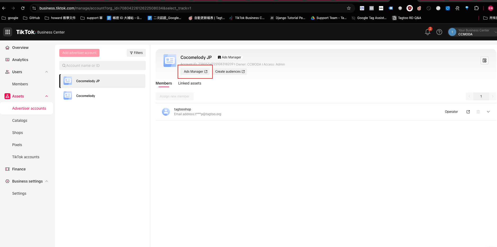

2. 點選 `tool` -> `events`
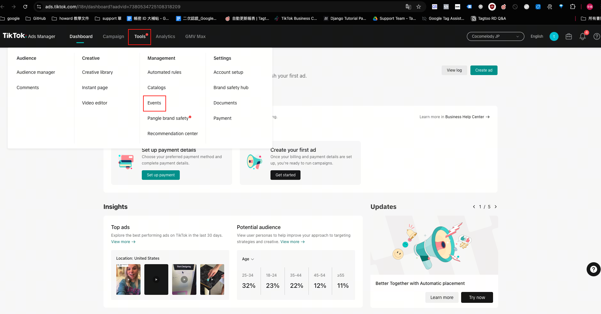

3. 點選 `Get Started` -> `Web`
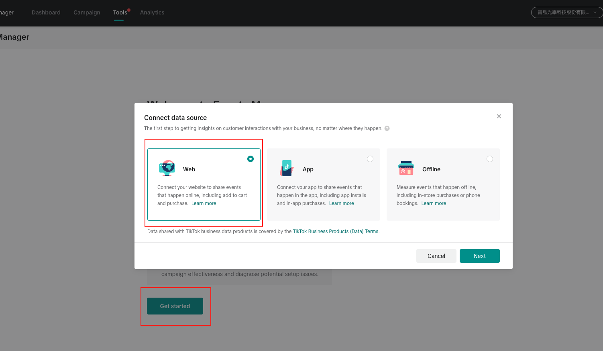

4. 點選 `加上網址`
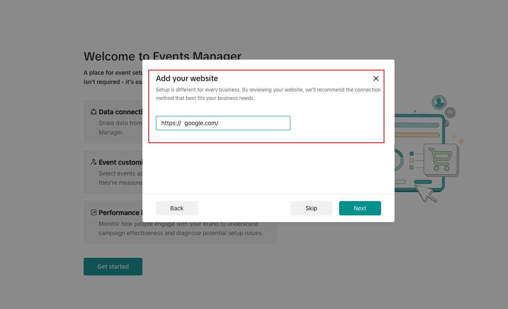

5. 點選 `manual setup`
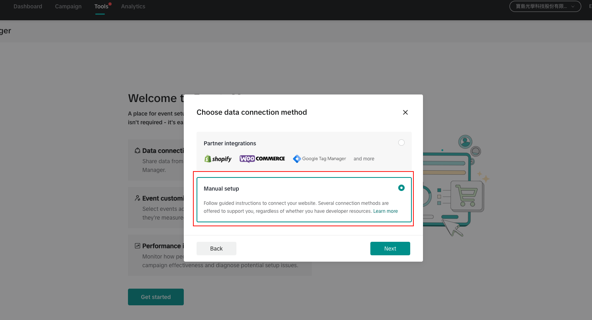

6. 看情況選取單純是做第三方事件，還是還有要做 s2s
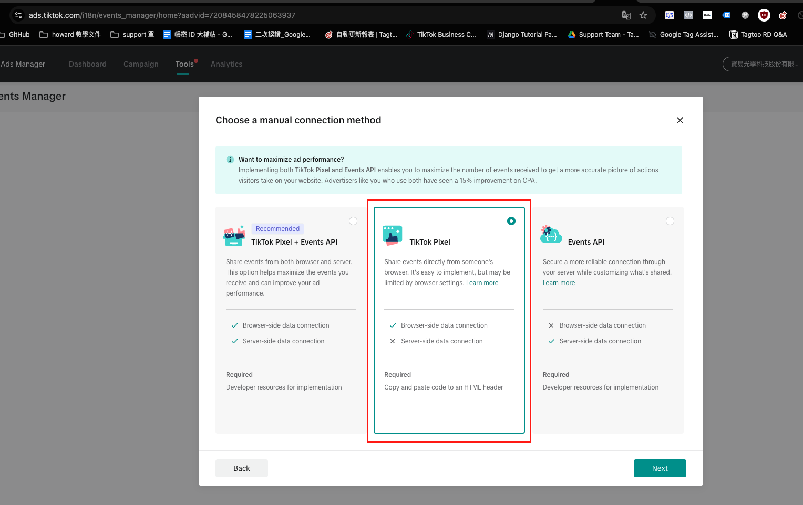

7. 幫 pixel 取名
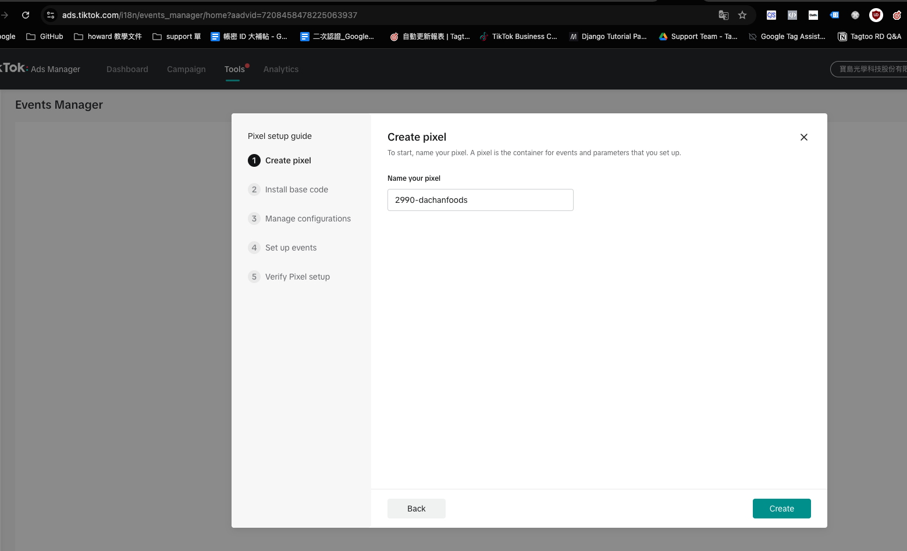

8. 這個步驟不用理他，這頁面是埋設 pixel 的資料，我們只需要他的 ID 而已，最後會有
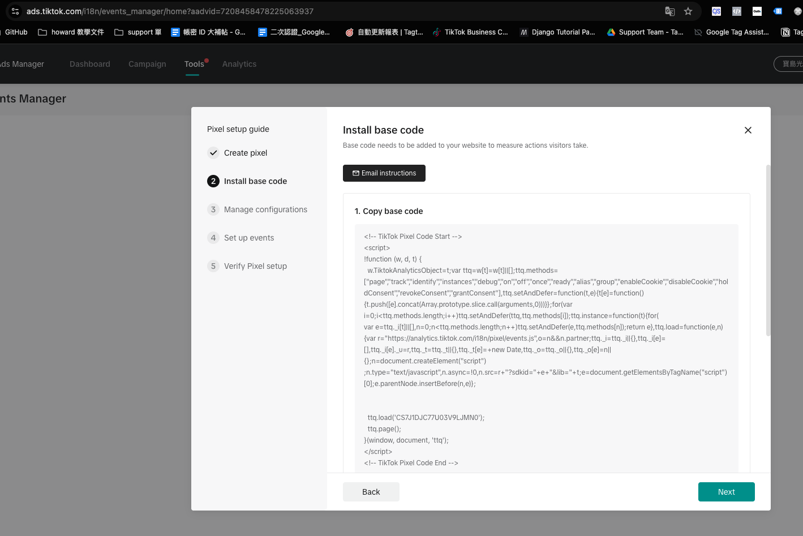

9~11. 一直按下一步就可以
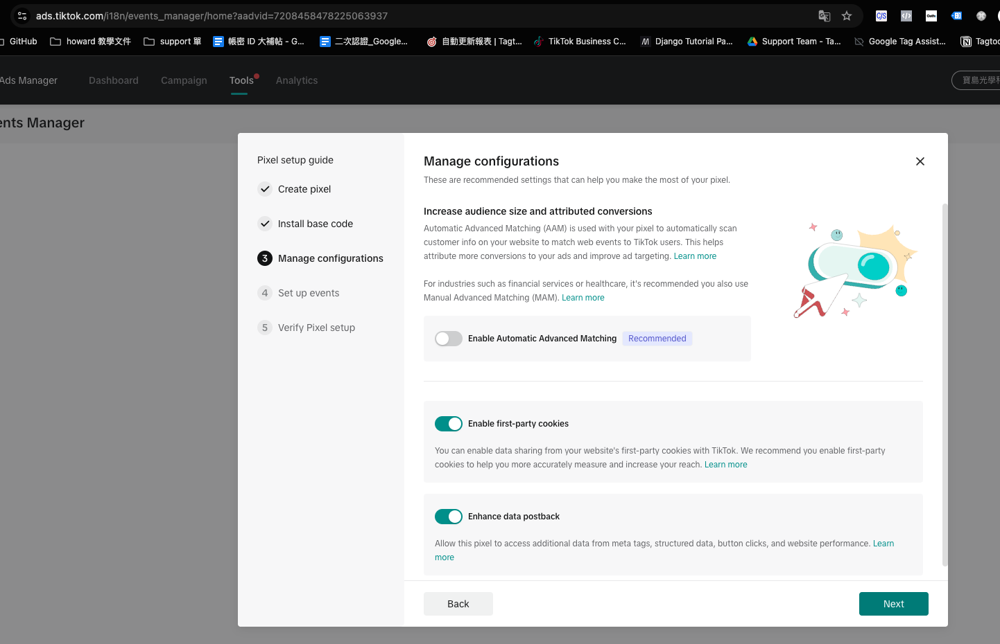
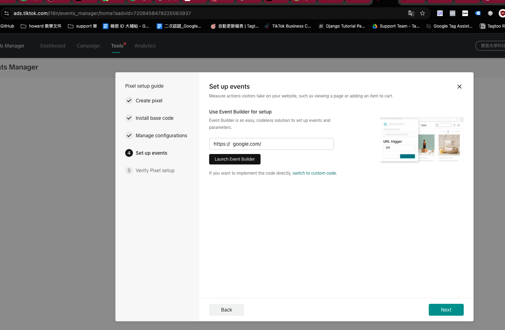
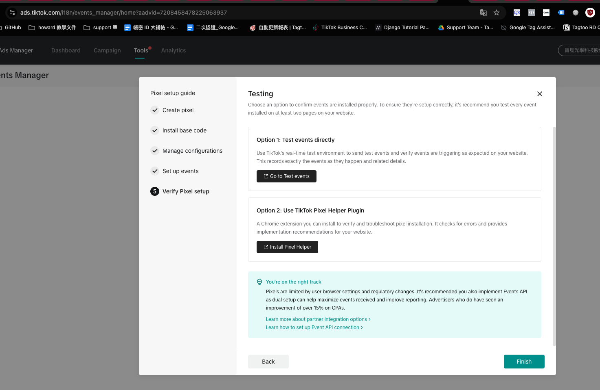

12. 拿到 tiktok 的 pixel ID
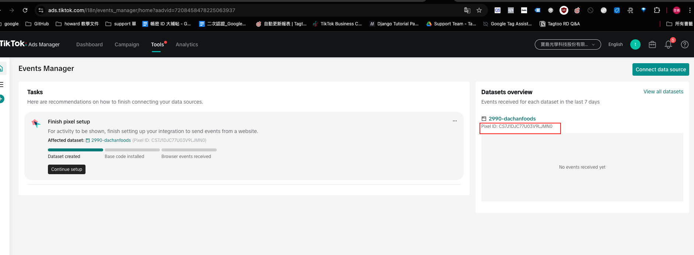

### PR、需求編號

[muffet] : https://github.com/Tagtoo/muffet/pull/2764
[編號] : 3635