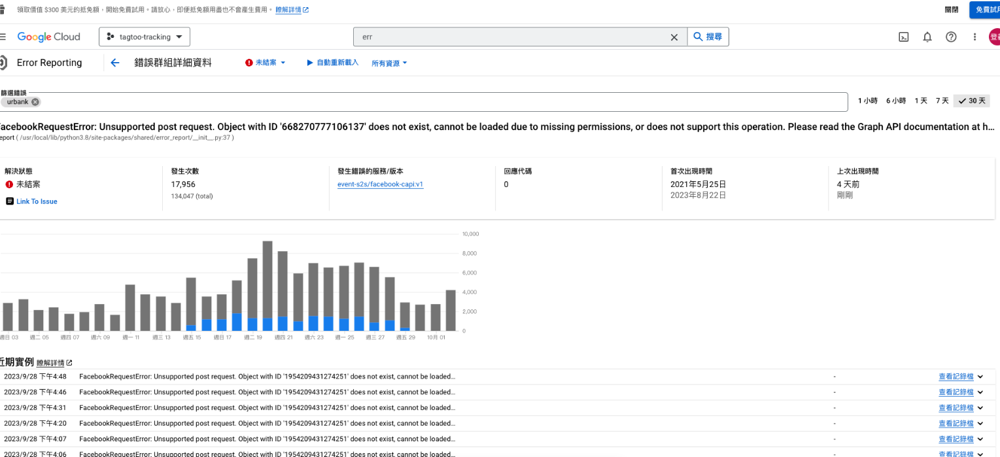

### 詳細說明

`像素：1954209431274251`   
客戶的S2S事件只剩下前端...請幫忙確認為什麼沒有後端事件"  

### 解決方法

s2s 的運作方式是，首先在 FB 後台會可以產出一個 `token`，這個 token 要放到 tagtoo Server，有時候會因為一些原因，導致 token 失效，此時就要到 GCP 看一下 token 的狀況。
那要如何看錯誤報告呢？首先到 `tagtoo-tracking`，並且找到 `Error Reporting`，最後在 `篩選錯誤` 欄位輸入 `urbank`，接著點進第一個錯誤，就可以看到下圖錯誤資訊，可以發現的確是 token 壞掉了。
 
這邊補上 s2s 的 errorReporting 圖片：

這時候只要跟 Howard 說明狀況，他應該會直接在 FB 後台產生一個新的 token，並放到 tagtoo server 上，這樣就可以解決這個問題

