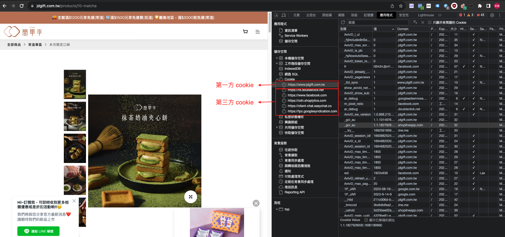

:::tip
在第三方 cookie 逐漸被禁止的情況下，要怎麼才能更好的追蹤到網站上的使用者呢
:::


## cookie 是啥

Cookie（曲奇餅）是一種小型的文本數據文件，通常由網站存儲在用戶的瀏覽器中。它們用於跟蹤用戶在網站上的活動、保持用戶的設置和狀態，以及提供個性化的網站體驗。Cookie 在 Web 開發中起著重要作用，它們的主要功能包括：

用戶識別：Cookie 可以用來識別瀏覽器和用戶。當您訪問一個需要登錄的網站時，網站會將一個唯一的識別碼存儲在 Cookie 中，以便在您訪問其他頁面時知道您是誰，而無需每次都重新登錄。  
session管理：有些 Cookie 被用來管理用戶的會話。這些 Cookie 在用戶訪問網站期間存儲，並在用戶退出或關閉瀏覽器後被刪除，以確保會話數據不會持久保留。  
狀態保持：網站可以使用 Cookie 來保存用戶的設置和首選項，以便在用戶下次訪問時保持這些設置。例如，一個網站可以記住您的語言選擇或字體大小設置。   
跟蹤和分析：許多網站使用 Cookie 來跟蹤用戶的活動，例如網頁瀏覽、點擊行為和購物習慣。這些數據可以用於分析和改進網站性能，以及提供個性化的內容和廣告。   
廣告和行銷：Cookie 也用於顯示目標廣告給用戶。廣告商和營銷人員可以使用 Cookie 記錄用戶的瀏覽行為，以便提供與用戶興趣相關的廣告。  
儘管 Cookie 在提供許多網絡功能方面非常有用，但它們也引發了隱私和安全方面的一些關注。因此，瀏覽器通常允許用戶控制哪些網站可以設置 Cookie，以及它們是否可以訪問這些 Cookie。此外，有一些法律法規（例如歐洲的GDPR）要求網站向用戶提供關於 Cookie 使用的透明信息並尊重用戶的隱私選擇。   
   
以上是 chat-GPT 所提供，不過如果不懂上面在說啥，簡單來講， `cookie 就是記錄使用者在網站做的事情`   

## 第一方 cookie V.S. 第三方 cookie

了解 cookie 在幹嘛後，就要了解 cookie 有分這兩種，分別是第一方和第三方，要怎麼分辨也很好分，先看下圖:  




可以發現，只要今天你的網域跟 cookie 名稱相同，那就是第一方 cookie，如果不同的話就是第三方~   


那為什麼會分這兩種呢？假設今天一個使用者瀏覽網站，就往產生該網站的 `第一方 cookie`，這個 cookie 會紀錄使用者的登入資訊、使用者的登入狀況   
ex. 使用者註冊登入後，如果關掉瀏覽器，只要 cookie 還在，使用者就不用再輸入帳號密碼一次   


而第三方 cookie 則是由其他人嵌入，以 google 為例，如果今天網站內有嵌入 `GA-Code` ，這段程式碼會產生 cookie，瀏覽器會寫入第三方程式碼所在的網域值，這與使用者主要瀏覽的網址網域並不一樣，這就是第三方建立的Cookie。   
ex. 產生了第三方 cookie 後，cookie 會紀錄網站上所有使用者到不同頁面的行爲，而這些數據都會送到第三方的數據搜集平台  


## CAPI VS 像素追蹤

前面了解 cookie 在幹嘛後，我們來解釋第三方 cookie 被禁止後的嚴重性，由於以前 facebook 都是埋設像素到客戶的網站，並產生第三方程式碼，最後把數據傳回 FB 後台，藉此達成搜集使用者數據、投放廣告，但未來第三方 cookie 被禁止，FB 要怎麼搜集使用者數據來投放廣告呢？


### 像素追蹤

傳統的facebook 數據追蹤，就是使用 第三方的 cookie，先在客戶網站埋入程式碼，這個程式碼會產生第三方 cookie，cookie 會紀錄使用者瀏覽網頁的資料，並回傳到 FB 的後台，最後我們使用這些資料來投廣告


### CAPI

使用者透過廣告進到網站後，FB 會為這個使用者生成一組 `Unique ID`，使用者在網站上瀏覽不同頁面時，該網站的 `伺服器` 會用 FB 產生的 `Unique ID` 來追蹤使用者的行為，最後會用 API 的方式，把這些數據紀錄發送給 FB。

FB 如何透過 API 收到數據？就是利用下面這一個連結，這個連結會由使用者的 server 發出 `POST Request`。
`若要傳送新事件，請從以下路徑向此 API 的 /events 關係連線發出 POST 要求：https://graph.facebook.com/{API_VERSION}/{PIXEL_ID}/events?access_token={TOKEN}。當您發佈到此關係連線時，Facebook 會建立新的伺服器事件。`


每一個 pixel 可以產生一個 token，這個 token 就是要帶入上面連結中的變數！


## 瀏覽器 vs 伺服器

1. 瀏覽器很容易知道是什麼？就是 `google`、`IE`、`火狐` 等等的瀏覽器  
2. 那伺服器是什麼呢？伺服器就是簡單說就是存放該網站文件的空間，像是網站的圖片、CSS、資料...等等，都會放在伺服器裡面   


## 程式碼

下面是API傳送資料的程式碼:
1. 送 request 會送的資料包括 `pixel_id`、`events`
2. pixel_id 就是你產 token 的那一組 pixel
3. events 就包括一大堆資料，包括 `雜湊處理過的 user_data`、事件名稱

```rb
require 'facebook_ads'

access_token = '<ACCESS_TOKEN>'
pixel_id = '<ADS_PIXEL_ID>'

FacebookAds.configure do |config|
  config.access_token = access_token
end

user_data = FacebookAds::ServerSide::UserData.new(
    emails: ['joe@eg.com'],
    phones: ['12345678901', '14251234567'],
    # It is recommended to send Client IP and User Agent for Conversions API Events.
    client_ip_address: request.remote_ip,
    client_user_agent: request.user_agent,
    fbc: 'fb.1.1554763741205.AbCdEfGhIjKlMnOpQrStUvWxYz1234567890',
    fbp: 'fb.1.1558571054389.1098115397'
)

content = FacebookAds::ServerSide::Content.new(
    product_id: 'product123',
    quantity: 1,
    delivery_category: 'home_delivery'
)

custom_data = FacebookAds::ServerSide::CustomData.new(
    contents: [content],
    currency: 'usd',
    value: 123.45
)

event = FacebookAds::ServerSide::Event.new(
    event_name: 'Purchase',
    event_time: Time.now.to_i,
    user_data: user_data,
    custom_data: custom_data,
    event_source_url: 'http://jaspers-market.com/product/123',
    action_source: 'website'
)

request = FacebookAds::ServerSide::EventRequest.new(
    pixel_id: pixel_id,
    events: [event]
)

print request.execute
```


參考連結: 
1. https://developers.facebook.com/docs/marketing-api/conversions-api/using-the-api
2. https://developer.mozilla.org/zh-TW/docs/Learn/Common_questions/Web_mechanics/What_is_a_web_server
