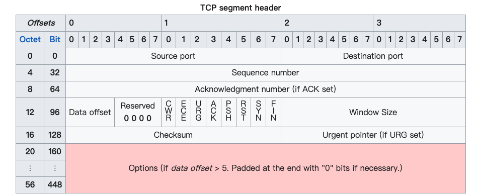
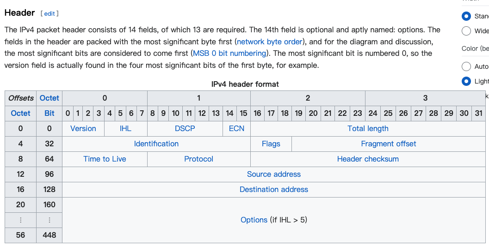

0、前言
------
:::tip
**寫此篇文章的動機**  
前面只有介紹各層負責的任務，這邊直接用實際案例來介紹，假如我瀏覽了一個網頁，OSI流程是怎麼樣的呢
:::

## 實際應用

今天我想要瀏覽麥當勞的網頁，第一層到第七層發生了哪些事情？   

### 傳送需求給麥當勞伺服器

#### 1. 應用層 (第七層)

* 首先我們在瀏覽器輸入網址: `www.mcdonalds.com` 並按下 Enter。
* 瀏覽器生成 HTTP GET 請求。

#### 2. 呈現層 (第六層)

* 將 HTTP 請求轉換成標準網路格式
* 應用 SSL/TLS 加密 (HTTPS)

#### 3. 工作階段層 (第五層)

* `使用者電腦` 與 `麥當勞 WEB 伺服器` 建立對話，管理連接狀態

#### 4. 傳輸層 (第四層)

* 使用者電腦透過 `TCP 協議` 將 `HTTP 請求` 分割成多個 `數據段 (Segments)`，為每個數據段 (Segments) 增加序號和 `port` 資訊 (port 443 / 80)

#### TCP Segment structure

Segments 的結構中，有很多的元素，這邊只先提兩種，就是 segment 裡面有兩個 `port`，代表來源和要送去的目的地

* Source port (16 bits): Identifies the sending port
* Destination port (16 bits): Identifies the receiving port

除了這兩種以外，還有很多的元素，可以看下圖：

#### 5. 網路層 (第三層)

這裡會把你的 `設備的 IP` 和 `麥當勞伺服器的 ip` 加入封包中！   

* 在這個階段，收到從傳輸層送來的 `segments` 後，會把每個 `segment` 封裝成一個 `IP 數據包 (packet)`，會把 `ip header` 加到每個 `segment` 的前面，分割好後，就會把 `packet`放入隊列，準備傳送進第二層。  

#### IP header structure
* Source address: This 32-bit field is the IPv4 address of the sender of the packet. It may be changed in transit by network address translation (NAT).
* Destination address: This 32-bit field is the IPv4 address of the receiver of the packet. It may be affected by NAT.

除了這兩種以外，還有很多的元素，可以看下圖：

#### 6. 資料傳輸層 (第二層)

上一層加入了 `IP 位置`，這一層會把 `你設備的 MAC(實體位置)` 和 `下一個網路設備的 MAC(實體位置) ex. 路由器` 加入 frame！

* 在這邊會先把剛剛傳來的 `封包 packet`，再次封裝成 `幀 frame`，這一次會加上 `幀頭和幀尾`，在這一層主要就是要添加 `MAC 地址`

#### Frame Header

* 目標 MAC 地址: 接收方的硬體地址
* 源 MAC 地址: 發送方的硬體地址

#### Frame Footer

* 幀間隔（Interframe Gap）: 不是嚴格意義上的幀尾部分，但在每個幀之後都會出現，允許設備為接收下一個幀做準備   

幀頭和幀尾還有其他的元素，這邊只些介紹這幾個。

#### 7. 實體層 (第一層)

將數字信號轉換為可以通過網絡介質（如 Wi-Fi 信號或以太網電纜）傳輸的物理信號，在這一層，會發生一系列的物理動作，這樣之後 `麥當勞的伺服器` 就會收到一連串的 `電子訊號`

### 麥當勞伺服器資料接收

剛剛前面一連串步驟，你已經把需求傳到麥當勞的 `web 伺服器`，接著進行逆向過程：

#### 物理層
`麥當勞伺服器` 接收到物理信號

#### 資料連接層
處理幀，驗證 MAC 地址，提取 IP 數據包。

#### 網路層
解析 IP 數據包，識別目標 IP 地址並確保數據到達正確的應用程序。

#### 傳輸層
重組 TCP 數據段，驗證數據的完整性和順序。

#### 會話層
管理會話的連續性。

#### 呈現層
解密數據（如果使用 HTTPS）。

#### 應用層
Web 服務器處理 HTTP 請求，生成響應（麥當勞網頁的 HTML、CSS、JavaScript 等）。

### 返回數據給客戶端

前面麥當勞已經收到完整的 HTTP request，並且產生出對應的內容。ex. `HTML 完整頁面, CSS 設定`，接著就是要把這些 `回應 response` 丟回給瀏覽者的電腦。     

#### 應用層（第七層）
* 生成 HTTP response: 伺服器在應用層生成一個 HTTP 響應，該響應包含
1. 狀態行: 包含 HTTP 協議版本和狀態碼（例如 HTTP/1.1 200 OK）。   
2. 響應標頭: 包含有關響應的元數據，例如內容類型（Content-Type: text/html）、內容長度（Content-Length）、日期等。  
3. 響應主體: 包含實際的內容，如 HTML 文檔、CSS 文件、JavaScript 文件等。  

#### 呈現層（第六層）
編碼和加密: 伺服器對數據進行格式化（例如壓縮）和加密（如果是 HTTPS），使其準備好進行傳輸。

#### 會話層（第五層）
管理會話: 確保響應數據與原請求保持關聯性，管理與客戶端之間的持續會話狀態。

#### 傳輸層（第四層）
拆分數據: 伺服器使用 TCP 協議將響應數據拆分成多個數據段（Segments），並為每個段增加序號，以確保數據能夠在接收端正確重組。
端口資訊: 添加目標端口（客戶端的臨時端口）和源端口（伺服器的端口，通常是 80 或 443）。

#### 網路層（第三層）
封裝成 IP 數據包: 將每個數據段（Segment）封裝成 IP 數據包（Packet），並加入 IP 標頭，包含伺服器的 IP 地址和客戶端的 IP 地址。
路由選擇: 決定數據包的路由，將其發送到目標客戶端。

#### 資料連接層（第二層）
封裝成幀（Frames）: 將 IP 數據包封裝成幀，加入 MAC 地址。這包括伺服器的 MAC 地址和下一個網絡設備（如路由器）的 MAC 地址。

#### 物理層（第一層）

物理傳輸: 將數據幀轉換成物理信號（電信號、光信號或無線電波），並通過物理介質（如光纖、以太網電纜或無線）傳輸。

### 客戶端電腦資訊接收

當我的電腦透過 wifi 傳到我的電腦後，就會自動開始進行解包的流程，像是以下：

1. 物理層: 客戶端的網絡接口接收物理信號，將其轉換回數據幀。
2. 資料連接層: 解封裝幀，提取 IP 數據包。
3. 網路層: 解封裝 IP 數據包，提取 TCP 數據段。
4. 傳輸層: 重組 TCP 數據段，檢查數據的完整性和順序，重組為完整的 HTTP 響應。
5. 會話層: 管理會話的連續性。
6. 表示層: 解密和解碼（如果是 HTTPS）。
7. 應用層: 瀏覽器接收到完整的 HTTP 響應，解析並渲染內容。

### 瀏覽器渲染網頁

* 解析 HTML: 瀏覽器解析響應中的 HTML，並生成 DOM（文檔對象模型）樹。
* 請求資源: 如果 HTML 中引用了其他資源（如 CSS、JavaScript、圖片等），瀏覽器會發起額外的 HTTP 請求來獲取這些資源。
* 渲染: 瀏覽器根據 DOM 樹和 CSS 樹繪製頁面，並執行 JavaScript 以實現互動性。

